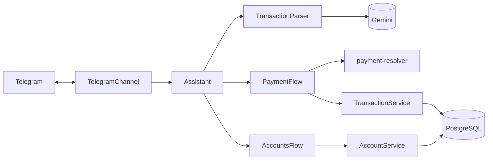

# bot-financeiro

Seu assessor financeiro pessoal no Telegram (e, se quiser, também no
[WhatsApp](#whatsapp-opcional)). Você manda uma mensagem, de texto ou de voz,
do jeito que falaria, e ele registra seus gastos e receitas, pergunta o que faltar e
acompanha a fatura do cartão e o saldo do VR/VA.

```
Você:  comprei uma cadeira de 500

Bot:   🤔 Como você pagou?
       • Cadeira: R$ 500,00
       [⚡ Pix] [🏧 Débito] [💳 Crédito]
       [🍽️ VR] [🛒 VA] [💵 Dinheiro]
       [❔ Outro] [❌ Cancelar]

       (você toca em 💳 Crédito e depois em Santander)

Bot:   ✅ Registrado:
       💸 Despesa · R$ 500,00
       Cadeira · Compras
       📅 24/09/2026 · Crédito Santander

       💳 Santander: fatura R$ 820,00 (fecha 05/10) · disponível R$ 2.180,00
       [↩️ Desfazer]
```

## Antes de começar

- **Cada pessoa tem o seu próprio bot.** Não existe um bot central: você cria o seu no
  Telegram, e ele roda no **seu** computador, com os **seus** dados. Ninguém mais, nem o
  autor deste projeto, tem acesso ao que você registra.
- **É de graça.** O Telegram é gratuito, e a IA usada (Google Gemini) tem uma camada
  gratuita que sobra para uso pessoal.
- **Precisa de um computador ligado.** O bot funciona enquanto o computador onde ele roda
  estiver ligado e conectado. Pode ser o seu notebook (Mac, Windows ou Linux) ou um
  servidor. Veja [Deixar ligado o tempo todo](#deixar-ligado-o-tempo-todo).
- **Leva uns 20 minutos** para configurar da primeira vez. Não precisa saber programar:
  é só seguir os passos e copiar os comandos.

## O que ele faz

- **Entende linguagem natural, em texto ou áudio:** "almoço 32 no pix", "ontem gastei 120
  no mercado", "uber 18,50 e café 7" (vira dois lançamentos), "recebi 1500 do estágio".
- **Pergunta o que faltar:** sem valor ("gastei no mercado"), ele pergunta quanto. Sem forma
  de pagamento, mostra botões. No crédito, pergunta em qual cartão. **Nada é salvo antes de
  você responder.**
- **Conhece seus cartões:** cadastre suas contas e cartões uma vez e cite pelo nome
  ("tênis 300 em 3x no santander"). O que dá para deduzir, ele não pergunta: se você só tem
  uma conta, Pix e débito vão direto para ela.
- **Acompanha o cartão de crédito:** a cada compra, mostra a fatura atual e quanto sobrou
  de limite. Compras parceladas entram na fatura pela parcela e reservam o total no limite,
  como o banco faz.
- **Acompanha o VR e o VA:** "recebi 600 de VA" e, a cada compra no VA, ele mostra quanto
  sobrou. O saldo acumula de um mês para o outro.
- **Mostra quanto sobra para investir:** `/resumo` traz o mês com receitas, despesas,
  sobra (receitas + resgates − despesas, sem contar VR/VA, que não dá para investir),
  quanto você investiu (os aportes) e o saldo da conta. Compras no crédito contam no mês da
  compra. Dá para navegar pelos meses anteriores.
- **Prevê o fim do mês:** no ritmo atual, quanto vai sobrar (ou faltar) no dia 30. A conta
  junta o que já aconteceu, os gastos fixos que ainda vão ser lançados e o seu gasto do dia a
  dia (média dos últimos 3 meses; sem esse histórico, o ritmo do próprio mês, a partir do dia
  7). Aparece no `/resumo` e no Painel da planilha. Se o mês for fechar no vermelho, o bot
  avisa (no máximo 1 vez por semana).
- **Responde perguntas sobre os seus gastos:** "quanto gastei com uber em setembro?",
  "gastei mais com mercado que no mês passado?", "qual mês eu mais gastei com lazer?",
  "qual meu maior gasto do mês?". A IA só entende a pergunta; a conta é feita pelo bot com
  os seus dados, então os números nunca são inventados.
- **"Posso gastar?":** "posso gastar 300 num tênis no itaú?" e ele responde ✅, ⚠️ ou ❌,
  olhando a previsão do mês, o orçamento da categoria e o limite do cartão.
- **Lembra você das contas:** na véspera do vencimento, às 9h, avisa a fatura de cada cartão
  e as contas fixas que você paga na mão, com um botão **Paguei** que já registra. E
  lembretes avulsos: "me lembra de pagar o IPVA dia 10, 800 reais". `/lembretes` lista tudo.
- **Registra investimentos:** "investi 500 no tesouro", "resgatei 200 da caixinha". Aporte
  e resgate não contam como gasto nem receita, e o bot soma o total em cada destino.
- **Orçamento por categoria:** defina um limite mensal (ex.: Alimentação R$ 800) e o bot
  avisa quando passar de 80% e de 100%.
- **Gastos fixos automáticos:** cadastre aluguel, assinaturas, academia… uma vez, e o bot
  lança sozinho todo mês no dia certo, avisando com um botão Desfazer. Para o que você
  paga na mão (boleto), escolha o modo lembrete: ele avisa na véspera e só lança no Paguei.
- **Planilha Google ao vivo (opcional):** tudo que você registra aparece numa planilha
  sua, com um **Painel** escuro com detalhes dourados: números do mês com comparação ao
  mês anterior, gráficos, orçamento e cartões com barras de uso, e uma lista para escolher
  o mês. Tudo se atualiza sozinho. Veja [Planilha Google](#planilha-google).
- **Metas de economia:** "Viagem: R$ 5.000 até dezembro". Os aportes com o nome da meta
  ("guardei 300 pra viagem") contam no progresso, e o bot mostra quanto guardar por mês e
  comemora quando você bate. A meta também pode acompanhar um investimento que você já tem.
- **Resumo semanal:** todo domingo às 19h, quanto você gastou, recebeu e guardou na semana,
  para onde foi o dinheiro e observações calculadas com os seus números (categoria que subiu
  em relação à média, orçamento perto do limite, previsão do mês, metas). `/semana` mostra a
  semana até agora.
- **Retrospectiva do ano:** em 1º de janeiro, o ano em números: quanto entrou, saiu e foi
  investido, melhor e pior mês, categorias, maior gasto e lugar mais frequente.
  `/retrospectiva` mostra o ano até agora.
- **Relatório do mês em PDF:** `/relatorio` manda o Painel do mês e a lista de todos os
  lançamentos num PDF, com botões para os meses anteriores. No dia 1, o aviso do mês
  fechado já vem com o PDF. Precisa da planilha.
- **Backup diário no Google Drive (opcional):** toda madrugada, uma cópia completa dos seus
  dados vai para uma pasta do seu Drive, guardando as 30 mais recentes. Veja
  [Backup automático no Google Drive](#backup-automático-no-google-drive).
- **Desfaz fácil:** cada registro tem um botão "Desfazer", e o comando `/desfazer` apaga o
  último lançamento.

## Instalação

### 1. Instale o Docker Desktop

O Docker é o programa que roda o bot e o banco de dados no seu computador.

1. Baixe em [docker.com/products/docker-desktop](https://www.docker.com/products/docker-desktop/)
   e instale como qualquer programa. No Windows, aceite o que o instalador pedir (ele pode
   pedir para reiniciar o computador).
2. Abra o **Docker Desktop** e espere até ele indicar que está rodando (o ícone da baleia
   fica parado na barra de menus, no Mac, ou na bandeja do sistema, no Windows).

### 2. Crie o seu bot no Telegram

1. No Telegram, procure **@BotFather** (tem o selo azul de verificado) e toque em **Iniciar**.
2. Mande `/newbot`.
3. Escolha um nome (ex.: `Meu Financeiro`) e depois um username terminado em `bot`
   (ex.: `financeiro_seunome_bot`). Se ele disser que o username já existe, tente outro.
4. Ele responde com um **token**, parecido com `8123456789:AAH...`. Copie e guarde: ele
   dá controle total do seu bot. Não compartilhe com ninguém. Se vazar, mande `/revoke` para
   o BotFather e gere outro.

### 3. Descubra o seu número de usuário no Telegram

Procure **@userinfobot** no Telegram e toque em **Iniciar**. Ele responde com o seu **Id**,
um número como `123456789`. O bot só vai responder a esse número: mensagens de qualquer
outra pessoa são ignoradas.

### 4. Crie a chave da IA (Google Gemini)

1. Entre em [aistudio.google.com/apikey](https://aistudio.google.com/apikey) com uma conta
   Google.
2. Clique em **Create API key** e copie a chave.

> **Sobre privacidade:** nos termos da API do Gemini, o que é enviado na camada gratuita
> (suas mensagens de gastos e áudios) pode ser usado pelo Google para melhorar os produtos.
> Isso não acontece se você ativar o faturamento no Google Cloud.

### 5. Baixe o projeto

Escolha **uma** das opções:

- **Sem precisar do git:** nesta página do GitHub, clique no botão verde **Code** e depois em
  **Download ZIP**. Descompacte a pasta onde quiser (ex.: em Documentos).
- **Com git** (facilita atualizar depois):
  ```bash
  git clone https://github.com/ViniKnuivers/bot-financeiro.git
  ```

Agora abra um terminal **dentro da pasta do projeto**:

- **Mac:** abra o app **Terminal**, digite `cd ` (com um espaço no final), arraste a pasta
  do projeto para a janela do Terminal e aperte Enter.
- **Windows:** abra a pasta no Explorador de Arquivos, clique com o botão direito num espaço
  vazio e escolha **Abrir no Terminal** (no Windows 10: segure Shift, clique com o botão
  direito e escolha **Abrir janela do PowerShell aqui**).

### 6. Coloque as suas chaves

Crie o arquivo de configuração a partir do modelo:

- **Mac/Linux:**
  ```bash
  cp .env.example .env
  open -e .env
  ```
- **Windows:**
  ```powershell
  copy .env.example .env
  notepad .env
  ```

No arquivo que abriu, preencha estas três linhas, logo depois do `=`, sem aspas e sem
espaços:

```env
TELEGRAM_BOT_TOKEN=8123456789:AAH...
ALLOWED_TELEGRAM_USER_ID=123456789
GEMINI_API_KEY=sua-chave-do-gemini
```

Salve e feche. Não mexa nas outras linhas: elas já vêm com valores que funcionam.

### 7. Ligue o bot

No terminal, ainda dentro da pasta do projeto:

```bash
docker compose --profile app up -d --build
```

Da primeira vez, leva alguns minutos (ele baixa e prepara tudo). Nas próximas, é rápido.
Para conferir se deu certo, abra [localhost:3000/health](http://localhost:3000/health) no
navegador: deve aparecer `{"status":"ok","database":"up"}`.

### 8. Teste

Abra o seu bot no Telegram (procure pelo username que você criou), toque em **Iniciar** e
mande `almoço 32 em dinheiro`. Se ele responder com o resumo e o botão Desfazer, está
funcionando! 🎉

## Como usar

### Primeiro: cadastre seus cartões

Mande `/cartoes` e toque em **➕ Adicionar**. Os tipos são:

| Tipo                  | Para quê                                                       |
| --------------------- | -------------------------------------------------------------- |
| 🏦 Conta (débito/pix) | Uma conta bancária, de onde saem o débito e o pix              |
| 💳 Crédito            | Um cartão de crédito                                           |
| 🏦💳 Conta + crédito  | Banco em que você tem as duas coisas (cria as duas de uma vez) |
| 🍽️ VR                 | Vale-refeição, com saldo                                       |
| 🛒 VA                 | Vale-alimentação, com saldo                                    |

- **No crédito**, o bot pede o **limite**, o **dia de fechamento** e o **dia de vencimento
  da fatura** (estão no app do banco). Com eles, ele mostra a fatura e o disponível a cada
  compra e te lembra do vencimento na véspera. Dá para pular e configurar depois.
- **Na conta bancária, no VR e no VA**, ele pede o saldo atual (o da conta você pode pular).
  Com ele, o bot acompanha quanto tem na conta: receitas e resgates somam; pix, débito,
  aportes e faturas pagas descontam.
- **Depois de cadastrar um cartão de crédito**, vá em **⚙️ Gerenciar → o cartão → Ajustar
  disponível** e digite o valor que o app do banco mostra. O bot não conhece as compras que
  você fez antes de começar a usá-lo, e esse ajuste corrige a diferença.

Em **⚙️ Gerenciar** você também renomeia, remove, ajusta o saldo do VR/VA e marca uma
fatura como paga (o que libera o limite dela).

> **Dica de nomes:** evite chamar o cartão de VR de "Alimentação", porque "vale-alimentação"
> é o nome do VA, e a IA pode se confundir. Prefira "Refeição", o nome do app (ex.: "Flash")
> ou simplesmente "VR" e "VA".

### Exemplos de mensagens

| Você manda                     | O bot faz                                                              |
| ------------------------------ | ---------------------------------------------------------------------- |
| `almoço 32 no pix`             | Registra na hora: Alimentação, Pix                                     |
| `comprei cadeira 500`          | Pergunta a forma de pagamento com botões                               |
| `tênis 300 em 3x no santander` | Registra no crédito do Santander, em 3 parcelas                        |
| `mercado 80 no VA`             | Registra e mostra quanto sobrou no VA                                  |
| `recebi 600 de VA`             | Soma no saldo do VA                                                    |
| `recebi 1500 do estágio`       | Registra uma receita (cai na sua conta)                                |
| `investi 500 no tesouro`       | Registra um aporte e mostra o total investido no Tesouro               |
| `resgatei 200 da caixinha`     | Registra um resgate (o dinheiro volta para a conta)                    |
| `ontem gastei 45 no ifood`     | Usa a data de ontem                                                    |
| `uber 18 e café 7`             | Registra dois lançamentos (e pergunta a forma de pagamento uma vez só) |
| 🎙️ Mensagem de voz             | Mesmo resultado, mostrando o que ele entendeu do áudio                 |

### Comandos

| Comando          | O que faz                                                             |
| ---------------- | --------------------------------------------------------------------- |
| `/cartoes`       | Seus cartões e contas: cadastrar, gerenciar, saldos, fatura e limite  |
| `/resumo`        | O mês: receitas, despesas, sobra, investido e saldos                  |
| `/orcamento`     | Limites mensais por categoria, com aviso aos 80% e 100%               |
| `/fixos`         | Gastos fixos que o bot lança sozinho (ou lembra) todo mês             |
| `/lembretes`     | Contas, faturas e lembretes que vencem nos próximos dias              |
| `/metas`         | Metas de economia: progresso, quanto guardar por mês, criar e remover |
| `/semana`        | Resumo da semana até agora, com observações                           |
| `/retrospectiva` | O ano em números (e os anos anteriores)                               |
| `/planilha`      | Link da sua planilha e situação da sincronização                      |
| `/grafico`       | Link direto para o Painel da planilha (números e gráficos)            |
| `/relatorio`     | Relatório do mês em PDF (Painel + todos os lançamentos)               |
| `/backup`        | Situação do backup no Google Drive, com botão para fazer um agora     |
| `/pendentes`     | Lançamentos esperando você responder a forma de pagamento             |
| `/ultimos`       | Seus 10 últimos lançamentos                                           |
| `/desfazer`      | Apaga o último lançamento                                             |
| `/start`         | Boas-vindas e exemplos                                                |

**Gastos fixos:** em `/fixos → Adicionar`, mande o gasto como sempre ("aluguel 1200 no pix")
e diga o dia do mês. Se o computador estiver desligado no dia, o bot lança quando ligar
(dentro do mesmo mês). Meses inteiros com o bot desligado não são lançados depois.
Para contas que você paga na mão, toque em **🔔 Prefiro o lembrete** (ou em Gerenciar):
o bot avisa na véspera, às 9h, e só lança quando você tocar em **Paguei**.

**Perguntas:** é só perguntar como falaria. Exemplos: "quanto gastei com ifood esse mês?",
"quanto recebi de freela este ano?", "quais foram meus gastos no crédito do itaú?", "com o
que eu mais gasto?", "posso gastar 200 num jantar?". Cada pergunta usa a IA uma vez, como um
lançamento.

**Lembretes:** "me lembra de pagar o IPVA dia 10, 800 reais", "lembrar de renovar o seguro
dia 20". O aviso sai na véspera, às 9h (se já passou, no próprio dia). Com valor, o botão
**Paguei e registrar** pergunta a forma de pagamento e registra. Os avisos saem com o bot
ligado: se o computador estiver desligado às 9h, eles saem quando ligar, no mesmo dia.

**Pagar a fatura não é um gasto novo** (os gastos já foram registrados nas compras). Quando
pagar, use `/cartoes → Gerenciar → o cartão → Paguei a fatura`.

## Planilha Google

Opcional, gratuito e leva uns 10 minutos, uma vez só. O bot escreve numa planilha **sua**,
no **seu** Google Drive, usando uma "conta de serviço": um usuário-robô que só enxerga as
planilhas que você compartilhar com ele.

### 1. Crie a conta de serviço no Google Cloud

1. Entre em [console.cloud.google.com](https://console.cloud.google.com) com a sua conta
   Google e crie um projeto (ex.: `bot-financeiro`). Não precisa de cartão de crédito.
2. No menu, vá em **APIs e serviços → Biblioteca**, procure **Google Sheets API** e clique
   em **Ativar**.
3. Vá em **APIs e serviços → Credenciais → Criar credenciais → Conta de serviço**. Dê um
   nome (ex.: `bot-financeiro`) e conclua. Não precisa dar nenhum papel/permissão.
4. Clique na conta criada, abra a aba **Chaves → Adicionar chave → Criar nova chave → JSON**.
   Um arquivo `.json` será baixado.
5. Renomeie o arquivo para `google-service-account.json` e coloque-o na pasta `secrets/`
   do projeto. **Não compartilhe esse arquivo**: ele dá acesso de escrita às planilhas
   compartilhadas com a conta.

### 2. Crie a planilha e compartilhe com o bot

1. Crie uma planilha em branco em [sheets.google.com](https://sheets.google.com).
2. Clique em **Compartilhar** e cole o e-mail da conta de serviço. Ele está no arquivo JSON,
   no campo `client_email`, e termina com `iam.gserviceaccount.com`. Escolha **Editor** e
   envie.
3. Copie o link da planilha (a barra de endereço do navegador) e cole no `.env`:
   ```env
   GOOGLE_SHEETS_ID=https://docs.google.com/spreadsheets/d/...
   ```

### 3. Reinicie o bot

```bash
docker compose --profile app up -d
```

Em alguns segundos a planilha ganha as abas **Painel, Lançamentos, Resumo, Categorias,
Cartões e vales** e **Investimentos**, todas no tema escuro. Mande `/planilha` no Telegram
para ver o link e a última sincronização, e `/grafico` para ir direto ao Painel.

**O Painel** é a primeira aba e mostra tudo numa tela:

- **Mês:** a lista no topo escolhe o mês. Tudo se ajusta na hora: os números, a rosca de
  categorias, o orçamento e os maiores gastos. "Mês atual" acompanha a virada do mês sozinho.
- **Cartões com os números do mês:** receitas, despesas, sobra, investido e o saldo das contas.
  Cada um mostra a comparação com o mês anterior: ▲ verde quando melhorou, ▼ vermelho quando
  piorou (em despesas, subir é vermelho).
- **Gráficos:** gastos por categoria, receitas × despesas dos últimos 12 meses, investido
  acumulado e faturas dos cartões (com as parcelas futuras).
- **Barras de uso:** orçamento por categoria e limite dos cartões ficam verdes, âmbar a partir
  de 80% e vermelhos acima de 100%.
- **Listas:** os 5 maiores gastos do mês escolhido e os 8 últimos lançamentos.

Os números vêm de uma aba oculta chamada **Dados**, que o bot preenche. Não é preciso
mexer nela.

Como funciona:

- A planilha é atualizada poucos segundos depois de cada lançamento.
- **Dá para editar a aba Lançamentos**, e o bot confere a cada minuto:
  - **corrigir** um valor, uma data, a categoria, a forma ou o cartão: o bot aplica e avisa
    no Telegram ("✏️ Atualizei pela planilha: Almoço: R$ 32,00 → R$ 35,00");
  - **adicionar** uma linha nova no fim (deixe a coluna ID vazia): serve para despesas,
    receitas, aportes e resgates. Use as listas de seleção das colunas Tipo, Categoria,
    Forma e Cartão/Conta;
  - **apagar** uma linha apaga o lançamento no bot, com um botão **Desfazer** no Telegram.
- Se uma edição tiver erro (ex.: uma categoria que não existe), o bot não aplica, escreve o
  motivo na coluna **Status** e avisa uma vez. Linhas novas com erro ficam na planilha para
  você corrigir.
- **Proteção contra acidentes:** se mais de 5 linhas sumirem de uma vez (ex.: a aba foi
  limpa sem querer), o bot não apaga nada, devolve as linhas e pergunta no Telegram.
- As outras abas (Painel, Resumo, Categorias, Cartões e vales, Investimentos) são
  calculadas pelo bot: editar nelas mostra um aviso, e a mudança é sobrescrita. A única
  exceção é a lista de mês do Painel, que é sua. Você pode criar abas próprias à vontade,
  que o bot não mexe nelas.
- Na aba Lançamentos, as categorias aparecem com emoji ("🍔 Alimentação"). Ao digitar, pode
  escrever só "Alimentação", que o bot entende.
- Apagar uma linha inteira de Lançamentos mostra o aviso "Pense bem!" do Google (a coluna ID,
  escondida, é protegida). É só confirmar.
- Se editar na planilha e, no mesmo minuto, mudar o mesmo lançamento pelo Telegram, vale a
  versão do bot (e ele avisa).
- Se a sincronização falhar (planilha não compartilhada, sem internet), o bot avisa uma
  vez no Telegram com a causa e sincroniza sozinho quando voltar. Nada se perde.

**Aviso do dia 1:** quando o mês vira, o bot manda o resumo do mês que fechou, com a
planilha e os gráficos já atualizados e os links para abrir. Se o computador estiver
desligado no dia 1, ele manda assim que ligar.

## WhatsApp (opcional)

Dá para conversar com o bot também pelo WhatsApp, usando a **API oficial da Meta** (nada
de programas "piratas", que podem banir o número). Telegram e WhatsApp funcionam juntos,
com os mesmos dados, e você pode ligar só um deles ou os dois.

> ⚠️ **No Brasil, é preciso um número brasileiro (+55) para o bot.** O número de teste
> gratuito da Meta é americano (+1 555), e desde setembro de 2025 a Meta bloqueia
> mensagens de empresas de fora do Brasil para usuários no Brasil. O bot recebe suas
> mensagens, mas as respostas não chegam: nos registros aparece o erro **130497**
> ("Business account is restricted from messaging users in this country"). Não há
> exceção para o número de teste. Por isso, para usar o WhatsApp no Brasil você precisa de
> um **chip pré-pago só para o bot**, cadastrado na Meta. O número de teste serve apenas
> para conferir a configuração.

**Antes de decidir, saiba das diferenças:**

- **Número:** um número só do bot. Seu número pessoal não serve, porque você não
  conseguiria conversar com você mesmo, e o número do bot não pode estar em uso no app do
  WhatsApp. A Meta pode pedir um cartão cadastrado na conta, mesmo dentro das mensagens
  grátis.
- **Custo:** desde 01/10/2026 a Meta cobra também as respostas do bot, com **1.000
  mensagens grátis por mês**. Com uso pessoal normal, você fica dentro das grátis. Ao chegar
  em 900 no mês, o bot avisa para você usar o Telegram até o mês virar. No Telegram, tudo é
  grátis e sem limite.
- **Botões:** até 3 opções aparecem como botões. Mais que isso, como uma lista
  ("Escolher").
- **Mensagens não são editadas:** a resposta a um toque chega como mensagem nova.
- **Comandos:** não há menu de comandos, mas digitar funciona igual (`/resumo`, `/cartoes`...).
- **Avisos automáticos (dia 1, gastos fixos...):** se você não falou com o bot nas últimas
  24h, a Meta só permite um modelo aprovado. Chega "📬 Você tem 1 aviso(s)… [Ver]", e ao
  tocar em **Ver** o bot manda os avisos. Esse modelo também conta no limite.

### 1. App na Meta e número de teste

1. Em [developers.facebook.com](https://developers.facebook.com), vá em **Meus apps → Criar
   app**. Escolha o caso de uso do WhatsApp e crie ou escolha um portfólio empresarial.
2. No menu do app, em **WhatsApp → Configuração da API**:
   - anote o **Phone number ID** do número de teste;
   - no campo **Para**, adicione o **seu** número de WhatsApp e confirme o código que chega.
3. Em **Configurações do app → Básico**, copie a **Chave secreta do app**.
4. O token dessa tela expira em 24h. Para ter um que não expira, vá em
   [business.facebook.com](https://business.facebook.com) → **Configurações → Usuários →
   Usuários do sistema**. Crie um (função **Admin**) e, em **Atribuir ativos**, dê controle
   total do app e da conta do WhatsApp. Depois clique em **Gerar token**: escolha o app,
   validade **Nunca** e as permissões `whatsapp_business_messaging` e
   `whatsapp_business_management`.

### 2. Endereço público (ngrok, grátis)

O WhatsApp precisa de um endereço na internet para entregar suas mensagens ao bot, que roda
no seu computador. Crie uma conta em [ngrok.com](https://ngrok.com) e anote o **Authtoken**
e o seu **domínio fixo grátis** (em **Domains**, algo como `nome-nome.ngrok-free.app`).

### 3. Preencha o `.env`

```env
WHATSAPP_ACCESS_TOKEN=token-do-usuário-do-sistema
WHATSAPP_PHONE_NUMBER_ID=id-do-número-de-teste
WHATSAPP_APP_SECRET=chave-secreta-do-app
WHATSAPP_VERIFY_TOKEN=uma-senha-que-você-inventa
ALLOWED_WHATSAPP_NUMBER=5511999998888
NGROK_AUTHTOKEN=authtoken-do-ngrok
NGROK_DOMAIN=nome-nome.ngrok-free.app
```

`ALLOWED_WHATSAPP_NUMBER` é o seu número com DDI e DDD, só dígitos. Mensagens de qualquer
outro número são ignoradas.

### 4. Ligue o bot com o WhatsApp

```bash
docker compose --profile app --profile whatsapp up -d --build
```

### 5. Conecte o webhook e crie o modelo de avisos

1. No app da Meta, em **WhatsApp → Configuração**, na parte de **Webhook**:
   - **URL de callback:** `https://SEU-DOMINIO.ngrok-free.app/webhooks/whatsapp`
   - **Token de verificação:** o mesmo `WHATSAPP_VERIFY_TOKEN` do `.env`
   - clique em **Verificar e salvar** e, em **Campos do webhook**, assine **messages**.
2. No **WhatsApp Manager → Modelos de mensagem → Criar modelo**:
   - categoria **Utilidade**, nome `avisos_pendentes`, idioma **Português (BR)**;
   - corpo: `📬 Você tem {{1}} aviso(s) novo(s) do seu bot financeiro.` (exemplo: `2`);
   - botão de **resposta rápida**: `Ver`.
     A aprovação costuma levar de minutos a algumas horas.

Pronto: mande "oi" para o número do bot no WhatsApp (no Brasil, o número +55; veja o aviso no começo desta seção).

**Número brasileiro (necessário no Brasil):** com o chip em mãos, no app da Meta, vá em
**Casos de uso → Personalizar → Etapa 2. Configuração da produção** e cadastre o número
(a confirmação chega por SMS ou ligação). Depois, crie o modelo `avisos_pendentes` de novo
para esse número e troque `WHATSAPP_PHONE_NUMBER_ID` no `.env`. Todo o resto continua igual.

**A Meta recebeu sua mensagem, mas o bot não respondeu?** Veja os registros do bot
(`docker compose logs app`). Se o WhatsApp recusar uma resposta, aparece
"a Meta não entregou uma mensagem do bot" com o motivo.

**Se nenhuma mensagem chega ao bot**, falta ligar a conta do WhatsApp ao seu app. Troque
os valores entre `<>` e rode uma vez:

```bash
curl -X POST -H "Authorization: Bearer <WHATSAPP_ACCESS_TOKEN>" https://graph.facebook.com/v25.0/<ID_DA_CONTA_DO_WHATSAPP_BUSINESS>/subscribed_apps
```

**Pausar o WhatsApp** sem apagar as chaves: coloque `WHATSAPP_ENABLED=false` no `.env` e
ligue o bot sem o perfil do WhatsApp (`docker compose --profile app up -d`).

## Deixar ligado o tempo todo

O bot só responde enquanto o computador estiver ligado, acordado e com o Docker aberto.

1. **Abrir o Docker sozinho:** no Docker Desktop, vá em **Settings → General** e marque
   **Start Docker Desktop when you sign in**. O bot volta sozinho depois de reiniciar o
   computador.
2. **Não deixar o computador dormir:**
   - **Windows:** Configurações → Sistema → Energia → coloque **Suspender** como **Nunca**
     quando estiver na tomada.
   - **Mac:** o macOS dorme ao fechar a tampa (a não ser com monitor externo). Para impedir,
     rode no Terminal (vai pedir a senha do Mac):
     ```bash
     sudo pmset -a disablesleep 1
     ```
     Para voltar ao normal: `sudo pmset -a disablesleep 0`.
   - Com o computador fechado e acordado, deixe-o na tomada e num lugar ventilado. Não
     guarde na mochila assim.
3. **Num servidor Linux (VPS):** os passos 5 a 7 funcionam igual em qualquer servidor com
   Docker. O bot não precisa de domínio, HTTPS nem porta aberta.

## Atualizar para uma versão nova

- **Se você usou git:**
  ```bash
  git pull
  docker compose --profile app up -d --build
  ```
- **Se você baixou o ZIP:** baixe o ZIP novo, descompacte, **copie o seu arquivo `.env`**
  da pasta antiga para a nova e rode, na pasta nova:
  ```bash
  docker compose --profile app up -d --build
  ```

Seus dados ficam guardados no Docker, fora da pasta, então não se perdem ao atualizar. As
mudanças no banco de dados são aplicadas sozinhas.

## Backup dos seus dados

### Backup automático no Google Drive

Todo dia, a partir das 3h, o bot faz uma cópia completa do banco e envia para a pasta
**"Financeiro – backups"** do seu Google Drive, guardando as 30 mais recentes (as mais
velhas vão para a lixeira do Drive). Se o computador estiver desligado nesse horário, o
backup sai quando ele ligar. Se falhar, o bot tenta de novo a cada hora e avisa no chat.

O bot pede só o acesso **`drive.file`**: ele enxerga apenas os arquivos que ele mesmo cria,
e nunca o resto do seu Drive. Configure uma vez (~10 minutos), no mesmo projeto do Google
Cloud da [planilha](#planilha-google):

1. **Ative a API do Drive:** em
   [console.cloud.google.com/apis/library/drive.googleapis.com](https://console.cloud.google.com/apis/library/drive.googleapis.com),
   com o projeto da planilha selecionado, clique em **Ativar**.
2. **Crie a tela de autorização:** em
   [console.cloud.google.com/auth/overview](https://console.cloud.google.com/auth/overview),
   clique em **Começar**. Nome do app: `bot-financeiro`; e-mail de suporte: o seu; público:
   **Externo**.
3. **Preencha o Branding** (menu da esquerda), que o Google exige para publicar:
   - página inicial: o link do projeto no GitHub;
   - política de privacidade: o link do [`PRIVACY.md`](PRIVACY.md) no GitHub;
   - domínios autorizados: `github.com`;
   - **sem logo** (com logo, o Google pede uma verificação que demora dias).
4. **Dê a permissão:** em **Acesso a dados → Adicionar ou remover escopos**, marque o que
   termina em `/auth/drive.file` e salve.
5. **Publique:** em **Público-alvo → Publicar app**. O status precisa ficar **Em produção**:
   em "Teste", a autorização vence a cada 7 dias. Não há revisão do Google, porque o
   `drive.file` não é um acesso sensível.
6. **Crie a credencial:** em **Clientes → Criar cliente**, tipo **App para computador**.
   Copie o ID e a chave secreta para o `.env`:
   ```env
   GOOGLE_OAUTH_CLIENT_ID=123-abc.apps.googleusercontent.com
   GOOGLE_OAUTH_CLIENT_SECRET=GOCSPX-...
   ```
7. **Reinicie o bot** (`docker compose --profile app up -d --build`) e mande **`/backup`**
   no Telegram. Abra o link **no computador onde o bot roda**: no fim da autorização, o
   Google volta para `http://127.0.0.1:3000`, o próprio bot. Se aparecer "O Google não
   verificou este app", é esperado (o app é seu): clique em **Avançado → Acessar
   bot-financeiro**. O bot confirma no chat e faz o primeiro backup.

| Variável              | Padrão                  | Para quê                                      |
| --------------------- | ----------------------- | --------------------------------------------- |
| `BACKUP_KEEP`         | `30`                    | Quantas cópias guardar                        |
| `BACKUP_HOUR`         | `3`                     | A partir de que hora sai o backup do dia      |
| `OAUTH_REDIRECT_BASE` | `http://127.0.0.1:3000` | Endereço do bot para o retorno da autorização |

**Para restaurar:** baixe o arquivo `.sql.gz` do Drive para a pasta do projeto e rode (no
Windows, descompacte antes com o 7-Zip e siga o "Para restaurar" do backup manual):

```bash
gunzip -c financeiro-2026-09-30-0300.sql.gz | docker compose exec -T db psql -U financeiro -d financeiro
```

A restauração substitui os dados atuais pelos do arquivo. A autorização do Drive não vai
dentro do backup (por segurança), então mande `/backup` de novo para reconectar.

### Backup manual

Faça de vez em quando, principalmente antes de atualizar. Na pasta do projeto:

```bash
docker compose exec db pg_dump -U financeiro --clean --if-exists -f /tmp/backup.sql financeiro
docker compose cp db:/tmp/backup.sql ./backup.sql
```

Isso cria um arquivo `backup.sql` na pasta. Guarde-o num lugar seguro: ele tem todos os seus
lançamentos. Para restaurar:

```bash
docker compose cp ./backup.sql db:/tmp/backup.sql
docker compose exec db psql -U financeiro -f /tmp/backup.sql financeiro
```

## Solução de problemas

| Problema                                          | O que fazer                                                                                                                           |
| ------------------------------------------------- | ------------------------------------------------------------------------------------------------------------------------------------- |
| `Cannot connect to the Docker daemon` ou parecido | O Docker Desktop não está aberto. Abra e espere ele ficar pronto.                                                                     |
| `no configuration file provided`                  | O terminal não está na pasta do projeto. Veja o passo 5.                                                                              |
| O bot não responde a nada                         | Confira o `ALLOWED_TELEGRAM_USER_ID` no `.env` e se o bot está ligado ([localhost:3000/health](http://localhost:3000/health)).        |
| `TELEGRAM_BOT_TOKEN inválido` nos logs            | Token copiado errado ou revogado. Pegue outro com o @BotFather.                                                                       |
| "A chave do Gemini foi recusada"                  | Confira o `GEMINI_API_KEY` no `.env`.                                                                                                 |
| "A IA está instável"                              | Os modelos gratuitos estão sobrecarregados. Tente de novo em alguns minutos.                                                          |
| "Atingi o limite de uso gratuito"                 | Muitas mensagens em pouco tempo. Espere um minuto.                                                                                    |
| `port is already allocated` ou erro 409           | Outra cópia do bot, ou outro programa, está usando a porta 3000 (bot) ou 5432 (banco). Feche-o, ou deixe só uma cópia do bot rodando. |
| O disponível do cartão não bate com o banco       | `/cartoes → Gerenciar → o cartão → Ajustar disponível`.                                                                               |

| A planilha não atualiza | `/planilha` mostra o motivo. O mais comum é não ter compartilhado a planilha como **Editor** com o `client_email` do JSON. |
| "Criação de chave desativada" no Google Cloud | Contas de empresa/escola podem bloquear chaves de conta de serviço. Use uma conta Google pessoal. |

**Mudou o `.env`?** Rode `docker compose --profile app up -d` para o bot ler os valores novos.

**Para ver o que o bot está fazendo** (útil para pedir ajuda): `docker compose logs -f app`.
Os logs não mostram o seu token nem a chave do Gemini.

**Desligar o bot:** `docker compose --profile app down`. Os dados continuam guardados; para
ligar de novo, repita o passo 7.

---

## Para desenvolvedores

Projeto de estudo e portfólio: TypeScript em modo estrito, arquitetura em camadas com
interfaces nas bordas, testes unitários e decisões documentadas.

### Rodando em modo de desenvolvimento

Requer Node.js 22.12+ e Docker.

```bash
npm install                     # também gera o Prisma Client
docker compose up -d db         # só o PostgreSQL
npm run db:migrate              # aplica as migrações
npm run dev                     # bot com recarga automática
```

Não rode `npm run dev` e a versão em Docker ao mesmo tempo: o Telegram só entrega as
mensagens para uma instância do bot por vez (a outra recebe erro 409), e as duas disputam a
porta 3000. Para desenvolver, pare a versão em Docker com `docker compose stop app`.

| Script               | O que faz                                 |
| -------------------- | ----------------------------------------- |
| `npm run dev`        | Roda com recarga automática (tsx watch)   |
| `npm test`           | Testes unitários (Vitest)                 |
| `npm run lint`       | ESLint com regras que checam tipos        |
| `npm run typecheck`  | Verificação de tipos do TypeScript        |
| `npm run format`     | Formata com Prettier                      |
| `npm run build`      | Compila para `dist/`                      |
| `npm run db:migrate` | Cria/aplica migrações em desenvolvimento  |
| `npm run db:studio`  | Interface visual do banco (Prisma Studio) |

### Stack

Node.js + TypeScript (strict), [Fastify](https://fastify.dev),
[grammY](https://grammy.dev), [Prisma 7](https://www.prisma.io) + PostgreSQL 18,
[Zod](https://zod.dev), [Google Gen AI SDK](https://github.com/googleapis/js-genai),
[Vitest](https://vitest.dev), ESLint + Prettier, Docker Compose.

### Arquitetura



As fronteiras com o mundo externo são **interfaces**: `MessageChannel` (Telegram),
`TransactionParser` (Gemini) e os repositórios (Prisma). Trocar o Telegram pelo WhatsApp, o
Gemini por outro modelo ou o Prisma por outro banco significa escrever uma nova
implementação, sem mexer no resto. O único lugar que conhece as peças concretas é o
[`src/main.ts`](src/main.ts).

```
src/
├── main.ts                 # composition root: monta e conecta as peças
├── config/env.ts           # variáveis de ambiente validadas com Zod
├── channels/               # MessageChannel + implementação do Telegram
├── assistant/              # conversa, independente de canal: pagamento e menu de cartões
├── ai/                     # TransactionParser + implementação com Gemini
├── prompts/                # system prompt da IA
├── modules/
│   ├── transactions/       # service, repository (Prisma), schemas e rótulos
│   ├── accounts/           # cartões e contas, saldo de VR/VA, faturas de crédito
│   ├── payments/           # resolver: o que perguntar sobre o pagamento
│   ├── pending/            # lançamentos esperando resposta
│   ├── goals/              # metas de economia (progresso pelos aportes)
│   ├── insights/           # perguntas, previsão, resumo semanal e retrospectiva
│   ├── sheets/             # planilha Google: sincronização, Painel e relatório em PDF
│   ├── backup/             # backup no Google Drive: pg_dump, OAuth (PKCE) e envio
│   └── conversation/       # passo atual de conversas com vários passos
├── http/                   # Fastify: /health e o retorno da autorização do Google
├── lib/                    # datas, dinheiro, logger, Prisma
└── test/                   # apoio aos testes (repositórios em memória)
```

### Decisões técnicas

- **Dinheiro em centavos inteiros.** Nunca `float`: `0.1 + 0.2 !== 0.3`. O banco também tem
  uma `CHECK (amountCents > 0)`; o sinal vem do tipo (despesa ou receita).
- **Datas sem hora (`DATE`).** O dia do gasto não muda por causa de fuso. A data de hoje é
  calculada no fuso do usuário antes de ir para a IA, com um calendário dos últimos 7 dias
  no prompt, porque modelos de linguagem erram aritmética de datas.
- **Um schema Zod, dois usos.** O mesmo schema vira o JSON Schema do _structured output_ do
  Gemini e valida a resposta antes de salvar. O JSON Schema é montado a cada chamada, com os
  nomes dos cartões do usuário como `enum`. Regras que ele não expressa (como "categoria de
  receita só em receita") ficam na validação.
- **Modelos reserva.** Na camada gratuita, um modelo específico às vezes responde 503 ou trava;
  o parser passa para o próximo da lista (`GEMINI_FALLBACK_MODELS`).
- **Perguntar sem perder nada.** Um lançamento sem forma de pagamento vira uma _pendência_
  no banco (não em memória): sobrevive a reinícios do bot e é listado em `/pendentes`. A
  decisão do que perguntar é uma função pura (`payment-resolver.ts`), fácil de testar.
- **`batchId` por mensagem.** As transações de uma mesma mensagem formam um lote, que o botão
  "Desfazer" apaga junto.
- **`callback_data` de até 64 bytes.** Por isso cartões e pendências têm ids inteiros
  (ex.: `pa:12:3`), e as transações usam UUIDv7 (`undo:<uuid>` ocupa 41 bytes), que também
  é ordenado por tempo e desempata a ordem de registro dentro de um lote.
- **Saldo e fatura nunca são guardados prontos.** Saldo do VA = saldo inicial + recargas −
  gastos; a fatura sai das compras e das faturas pagas. Tudo calculado na hora, então
  desfazer um lançamento corrige os valores automaticamente.
- **Regras de fatura.** Cada compra cai na fatura que fecha no mesmo mês, se foi antes do
  dia de fechamento, ou na do mês seguinte. A parcela k cai k meses depois, e a primeira
  fica com o resto da divisão (100,00 em 3x = 33,34 + 33,33 + 33,33). Tudo em funções puras
  em `credit-invoice.ts`.
- **Limitação do disponível.** O bot não conhece compras feitas antes de o cartão ser
  cadastrado, nem pagamentos parciais de fatura. "Ajustar disponível" guarda a diferença
  para o total bater com o do banco.
- **Passos de conversa expiram.** Depois de "Qual o nome do cartão?", o próximo texto é o
  nome. Se você esquecer de responder, em 15 minutos o bot volta a tratar textos como
  lançamentos.
- **Nome fixo do projeto Docker** (`name:` no `docker-compose.yml`). Sem ele, o volume do
  banco dependeria do nome da pasta, e baixar o ZIP numa pasta nova criaria um banco vazio.
- **Observações sem IA.** O resumo semanal e a retrospectiva são calculados pelo bot com os
  seus lançamentos (média das 4 semanas anteriores, proporcional numa semana em curso), sem
  gastar cota nem arriscar números inventados. A meta não guarda saldo: é o saldo do destino
  de aporte, calculado na hora, então desfazer um aporte corrige a meta sozinho.
- **Relatório em PDF pela própria planilha.** A aba oculta "Relatório" é gerada pelo mesmo
  código do Painel (uma "variante" com outra aba, outra célula de mês e outra área de
  apoio), mais a lista do mês por `FILTER`. O PDF sai pela exportação do Google, só até a
  última linha da lista, sem nenhuma dependência nova.
- **Backup sem guardar a chave junto.** A autorização do Drive fica na tabela
  `credentials`, que o `pg_dump` exporta só com a estrutura (`--exclude-table-data`). O
  OAuth é de app para computador, com PKCE e `state` de uso único, e o retorno local só
  aceita pedidos diretos (não repassados pelo ngrok).
- **Nenhum segredo no log.** Algumas bibliotecas colocam o token na mensagem de erro (o
  grammY inclui a URL `api.telegram.org/bot<token>` quando a rede falha). Toda linha de log
  passa por um filtro que esconde tokens e códigos de autorização antes de ser escrita.
- **Filtro de usuário e de chat privado.** Mensagens de outras pessoas são ignoradas sem
  resposta. O bot também ignora grupos, para seus gastos não aparecerem para outros.

## Licença

[MIT](LICENSE). Use, modifique e compartilhe à vontade.
