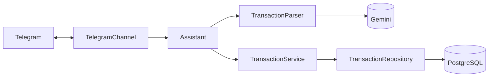

# bot-financeiro

Assessor financeiro pessoal no Telegram. Você manda uma mensagem de texto ou de voz do
jeito que falaria ("almoço 32 no pix e uber 18,50 ontem"), uma IA (Google Gemini)
interpreta, e o bot registra os gastos e receitas num banco PostgreSQL.

```
Você:  almoço 32 no pix e uber 18,50 ontem

Bot:   ✅ Registrei 2 lançamentos:

       💸 Despesa · R$ 32,00
       Almoço · Alimentação
       📅 23/09/2026 · Pix

       💸 Despesa · R$ 18,50
       Uber · Transporte
       📅 22/09/2026
                                 [ ↩️ Desfazer ]
```

Cada pessoa roda a **própria instância**: o bot responde a um único usuário do Telegram,
com as suas próprias chaves e o seu próprio banco. Nada é compartilhado com o autor.

## Funcionalidades

- **Texto e voz.** Mensagens de voz vão direto para o Gemini, que transcreve e interpreta
  de uma vez (sem serviço de transcrição separado).
- **Várias transações por mensagem.** "ifood 45,90 e netflix 55" vira dois lançamentos.
- **Datas relativas.** "ontem", "anteontem", "sexta", "dia 5", no fuso America/Sao_Paulo.
- **Pergunta quando falta algo.** "gastei no mercado" → "Quanto você gastou no mercado?"
  Nada é salvo até a informação estar completa.
- **Pergunta a forma de pagamento.** "comprei cadeira 500" → botões [Pix] [Débito]
  [Crédito] [VR] [VA]…; no crédito, pergunta **em qual cartão**. Só salva depois da
  resposta, e só pergunta o que não dá para deduzir (Pix com uma única conta bancária, por
  exemplo, já vai direto para ela).
- **Cartões com nome.** Cadastre suas contas e cartões em `/cartoes` (ex.: Itaú com conta e
  crédito, Santander só crédito) e cite pelo nome: "tênis 300 em 3x no santander".
- **VR e VA com saldo.** "recebi 600 de VA" e, a cada compra no VA, o bot mostra quanto
  sobrou. O saldo acumula de um mês para o outro.
- **Fatura e limite do crédito.** Informe o limite e o dia de fechamento do cartão e, a cada
  compra, o bot mostra `💳 Santander: fatura R$ 820,00 (fecha 05/10) · disponível R$ 2.180,00`.
  Compras parceladas entram na fatura pela parcela, mas reservam o total no limite (como o
  banco faz). Em `/cartoes` você marca uma fatura como paga, o que libera o limite.
- **Compras parceladas.** "300 em 3x" guarda o total e o número de parcelas.
- **Desfazer.** Botão em cada registro, e o comando `/desfazer` para o último lançamento.
- **Auditoria.** Cada transação guarda o texto original (ou a transcrição do áudio) e a origem.
- **Resiliente à camada gratuita.** Se o modelo principal do Gemini estiver sobrecarregado,
  o bot tenta modelos reserva automaticamente.

### Comandos

| Comando      | O que faz                                                                        |
| ------------ | -------------------------------------------------------------------------------- |
| `/start`     | Boas-vindas e exemplos                                                           |
| `/cartoes`   | Cartões e contas: cadastrar, renomear, remover, saldos de VR/VA, fatura e limite |
| `/pendentes` | Lançamentos esperando você responder a forma de pagamento                        |
| `/ultimos`   | Seus 10 últimos lançamentos                                                      |
| `/desfazer`  | Apaga o último lançamento registrado                                             |

### Categorias

- **Despesas:** Alimentação, Mercado, Transporte, Moradia, Contas, Saúde, Educação, Lazer,
  Assinaturas, Compras, Outros.
- **Receitas:** Salário, Estágio, Freela, Vale-refeição, Vale-alimentação, Outras receitas.

## Como rodar o seu

Você vai precisar de [Docker](https://www.docker.com/products/docker-desktop/) instalado.
Não precisa de Node.js para só usar o bot.

### 1. Crie o bot no Telegram

1. No Telegram, procure **@BotFather** (tem o selo azul de verificado) e toque em Iniciar.
2. Mande `/newbot`.
3. Escolha um nome (ex.: `Meu Financeiro`) e um username terminado em `bot`
   (ex.: `financeiro_seunome_bot`).
4. Ele responde com um **token** parecido com `8123456789:AAH...`. Guarde: ele dá controle
   total do bot. Se vazar, mande `/revoke` para o BotFather e gere outro.

### 2. Descubra o seu user ID

Procure **@userinfobot** no Telegram e toque em Iniciar. Ele responde com o seu **Id**,
um número como `123456789`. Só esse usuário vai conseguir falar com o bot.

### 3. Crie a chave do Gemini

1. Entre em [aistudio.google.com/apikey](https://aistudio.google.com/apikey) com uma conta Google.
2. Clique em **Create API key** e copie a chave.

A camada gratuita é suficiente para uso pessoal. Atenção: nos termos da API do Gemini, o
conteúdo enviado na camada gratuita pode ser usado pelo Google para melhorar os produtos.
Isso não acontece se o faturamento estiver ativado no Google Cloud.

### 4. Baixe o projeto e configure

```bash
git clone https://github.com/ViniKnuivers/bot-financeiro.git
cd bot-financeiro
cp .env.example .env
```

Abra o `.env` e preencha, sem aspas e sem espaços:

```env
TELEGRAM_BOT_TOKEN=8123456789:AAH...
ALLOWED_TELEGRAM_USER_ID=123456789
GEMINI_API_KEY=sua-chave
```

As outras variáveis já vêm com valores que funcionam.

### 5. Suba tudo

```bash
docker compose --profile app up -d --build
```

Isso sobe o PostgreSQL, aplica as migrações do banco e inicia o bot. Confira:

```bash
curl localhost:3000/health          # {"status":"ok","database":"up"}
docker compose logs -f app          # deve aparecer "telegram: bot ouvindo"
```

Abra o seu bot no Telegram e mande `/start`. Depois, cadastre seus cartões em `/cartoes`
(opcional, mas é o que permite escolher o cartão e ver o saldo do VR/VA) e mande algo como
`almoço 32 no pix`.

### Deixar rodando o tempo todo

Os containers reiniciam sozinhos se caírem (`restart: unless-stopped`). Para o bot
sobreviver a um reinício do computador, o Docker precisa abrir sozinho:
**Docker Desktop → Settings → General → Start Docker Desktop when you sign in**.

**Num Mac com a tampa fechada:** por padrão o macOS dorme ao fechar a tampa (a não ser com
monitor externo), e o bot para. Para impedir:

```bash
sudo pmset -a disablesleep 1     # desfazer: sudo pmset -a disablesleep 0
```

Deixe o Mac na tomada e em lugar ventilado: fechado e acordado, ele esquenta mais. Não
guarde na mochila com isso ligado.

**Num servidor Linux (VPS):** os mesmos passos 4 e 5 funcionam em qualquer servidor com
Docker. O bot usa long polling, então não precisa de domínio, HTTPS nem porta aberta.

### Atualizar

```bash
git pull
docker compose --profile app up -d --build
```

Migrações novas do banco são aplicadas automaticamente antes de o bot subir.

### Comandos úteis

```bash
docker compose logs -f app                 # logs do bot
docker compose --profile app down          # para tudo (os dados continuam salvos)
docker compose exec db psql -U financeiro  # acessa o banco direto
```

## Desenvolvimento

Requer Node.js 22.12+ e Docker.

```bash
npm install                     # também gera o Prisma Client
docker compose up -d db         # só o PostgreSQL
npm run db:migrate              # aplica as migrações
npm run dev                     # bot com recarga automática
```

Não rode `npm run dev` e a versão em Docker ao mesmo tempo: o Telegram só entrega as
mensagens para uma instância do bot por vez (a outra recebe erro 409), e as duas disputam a
porta 3000. Para desenvolver, pare a versão em Docker com `docker compose stop app`.

| Script               | O que faz                                 |
| -------------------- | ----------------------------------------- |
| `npm run dev`        | Roda com recarga automática (tsx watch)   |
| `npm test`           | Testes unitários (Vitest)                 |
| `npm run lint`       | ESLint com regras que checam tipos        |
| `npm run typecheck`  | Verificação de tipos do TypeScript        |
| `npm run format`     | Formata com Prettier                      |
| `npm run build`      | Compila para `dist/`                      |
| `npm run db:migrate` | Cria/aplica migrações em desenvolvimento  |
| `npm run db:studio`  | Interface visual do banco (Prisma Studio) |

### Stack

Node.js + TypeScript (strict), [Fastify](https://fastify.dev),
[grammY](https://grammy.dev), [Prisma 7](https://www.prisma.io) + PostgreSQL 18,
[Zod](https://zod.dev), [Google Gen AI SDK](https://github.com/googleapis/js-genai),
[Vitest](https://vitest.dev), ESLint + Prettier, Docker Compose.

### Arquitetura



As três fronteiras com o mundo externo são **interfaces**: `MessageChannel` (Telegram),
`TransactionParser` (Gemini) e `TransactionRepository` (Prisma). Trocar o Telegram pelo
WhatsApp, o Gemini por outro modelo ou o Prisma por outro banco significa escrever uma nova
implementação, sem mexer no resto. O único lugar que conhece as peças concretas é o
[`src/main.ts`](src/main.ts).

```
src/
├── main.ts                 # composition root: monta e conecta as peças
├── config/env.ts           # variáveis de ambiente validadas com Zod
├── channels/               # MessageChannel + implementação do Telegram
├── assistant/              # conversa, independente de canal: pagamento e menu de cartões
├── ai/                     # TransactionParser + implementação com Gemini
├── prompts/                # system prompt da IA
├── modules/
│   ├── transactions/       # service, repository (Prisma), schemas e rótulos
│   ├── accounts/           # cartões e contas, saldo de VR/VA
│   ├── payments/           # resolver: o que perguntar sobre o pagamento
│   ├── pending/            # lançamentos esperando resposta
│   └── conversation/       # passo atual de conversas com vários passos
├── http/server.ts          # Fastify: /health
├── lib/                    # datas, dinheiro, logger, Prisma
└── test/                   # apoio aos testes (repositório em memória)
```

### Decisões técnicas

- **Dinheiro em centavos inteiros.** Nunca `float`: `0.1 + 0.2 !== 0.3`. O banco também tem
  uma `CHECK (amountCents > 0)`; o sinal vem do tipo (despesa ou receita).
- **Datas sem hora (`DATE`).** O dia do gasto não muda por causa de fuso. A data de hoje é
  calculada no fuso do usuário antes de ir para a IA, com um calendário dos últimos 7 dias
  no prompt, porque modelos de linguagem erram aritmética de datas.
- **Um schema Zod, dois usos.** O mesmo schema vira o JSON Schema do _structured output_ do
  Gemini e valida a resposta antes de salvar. Regras que o JSON Schema não expressa (como
  "categoria de receita só em receita") ficam na validação.
- **`batchId` por mensagem.** As transações de uma mesma mensagem formam um lote, que o botão
  "Desfazer" apaga junto. O `callback_data` do Telegram tem limite de 64 bytes, e
  `undo:<uuid>` ocupa 41.
- **UUIDv7 como id.** É ordenado por tempo, o que dá um índice mais eficiente e desempata a
  ordem de registro dentro de um lote.
- **Modelos reserva.** Na camada gratuita, um modelo específico às vezes responde 503 ou trava;
  o parser passa para o próximo da lista (`GEMINI_FALLBACK_MODELS`).
- **Perguntar sem perder nada.** Um lançamento sem forma de pagamento vira uma _pendência_
  no banco (não em memória): sobrevive a reinícios do bot e é listado em `/pendentes`. A
  decisão do que perguntar é uma função pura (`payment-resolver.ts`), fácil de testar.
- **Ids inteiros para cartões e pendências.** Eles vão no `callback_data` dos botões,
  junto com a ação (ex.: `pa:12:3`), e o limite é de 64 bytes.
- **Saldo nunca é guardado pronto.** Saldo do VA = saldo inicial + recargas − gastos,
  calculado na hora. Assim, desfazer um lançamento corrige o saldo automaticamente.
- **Passos de conversa expiram.** Depois de "Qual o nome do cartão?", o próximo texto é o
  nome. Se você esquecer de responder, em 15 minutos o bot volta a tratar textos como
  lançamentos.
- **Fatura calculada, não guardada.** Cada compra cai na fatura que fecha no mesmo mês, se
  foi antes do dia de fechamento, ou na do mês seguinte. A parcela k cai k meses depois, e a
  primeira fica com o resto da divisão (100,00 em 3x = 33,34 + 33,33 + 33,33). Tudo isso sai
  de funções puras em `credit-invoice.ts`, a partir das transações e das faturas pagas.
- **Limitação do disponível.** O bot não conhece compras feitas antes de o cartão ser
  cadastrado, nem pagamentos parciais de fatura. Para o valor bater com o do banco, use
  `/cartoes → Gerenciar → Ajustar disponível`: o bot guarda a diferença como ajuste.
- **Filtro de usuário e de chat privado.** Mensagens de outras pessoas são ignoradas sem
  resposta. O bot também ignora grupos, para seus gastos não aparecerem para outros.

## Solução de problemas

| Sintoma                                | Causa provável e solução                                        |
| -------------------------------------- | --------------------------------------------------------------- |
| `TELEGRAM_BOT_TOKEN inválido` nos logs | Token copiado errado ou revogado. Pegue outro com o @BotFather. |
| Bot não responde a nada                | `ALLOWED_TELEGRAM_USER_ID` errado, ou o bot não está rodando.   |
| "A chave do Gemini foi recusada"       | Confira `GEMINI_API_KEY` no `.env` e rode `up -d` de novo.      |
| "A IA está instável"                   | Todos os modelos sobrecarregados. Tente em alguns minutos.      |
| "Atingi o limite de uso gratuito"      | Limite de requisições por minuto. Espere um minuto.             |
| `EADDRINUSE` ou erro 409 do Telegram   | Duas instâncias do bot rodando. Deixe só uma.                   |

Depois de editar o `.env`, recrie o container para ele ler os valores novos:
`docker compose --profile app up -d`.

## Licença

[MIT](LICENSE). Use, modifique e compartilhe à vontade.
